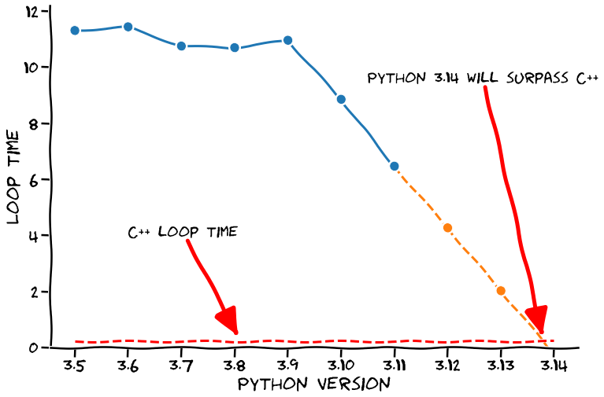
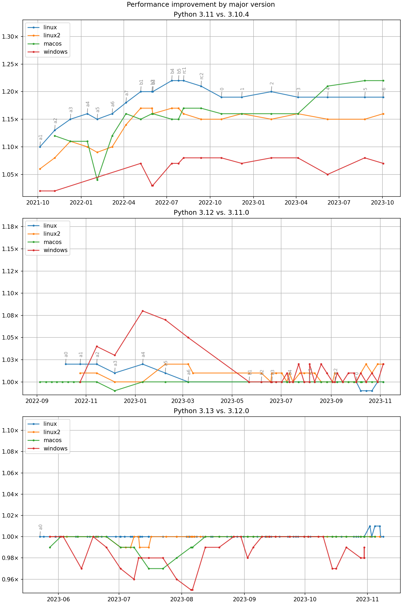

.. toctree::
   :glob:
   :hidden:

   *

.. _intro:

#####################################
¿Qué hay de nuevo en **Python 3.12**?
#####################################

.. revealjs-section::
    :data-background-color: #ffffff
    :data-background-image: _static/grid-bg.png
    :data-background-repeat: repeat-x
    :data-background-position: left top
    :data-background-size: auto
    :data-transition: zoom

.. image:: images/python-logo.*
  :width: 200

.. revealjs-notes::

  Hola a todos.

👋
==

.. revealjs-section::
    :data-background-color: #ffffff
    :data-background-image: _static/grid-bg.png
    :data-background-repeat: repeat-x
    :data-background-position: left top
    :data-background-size: auto
    :data-transition: zoom

.. revealjs-notes::

  Tal vez algunos me reconozcáis de la charla que di el año pasado aquí mismo

Python 3.11
===========

.. revealjs-section::
    :data-background-color: #ffffff
    :data-background-image: _static/grid-bg.png
    :data-background-repeat: repeat-x
    :data-background-position: left top
    :data-background-size: auto
    :data-transition: zoom

.. revealjs-notes::

    Sobre Python 3.11. Parece que se está convirtiendo en una tradición.

Python 3.13
===========

**?**

.. revealjs-section::
    :data-background-color: #000000
    :data-background-gradient: radial-gradient(circle, rgba(0,0,0,1) 0%, rgba(60,60,60,1) 80%)
.. revealjs-notes::

    No sé si podéis adivinar sobre qué irá la charla del año que viene.

Sobre mí **Nekmo**
==================

.. revealjs-section::
    :data-transition: concave
    :data-background-color: #2b5b84
    :data-background-gradient: linear-gradient(180deg, rgba(10,59,102,1) 0%, rgba(43,91,132,1) 30%)

+------------------------------------+
|                                    |
| .. image:: images/cara.svg         |
|   :width: 200px                    |
|                                    |
| *Programador Python*               |
|                                    |
+------------------------------------+

.. revealjs-notes::

  Pero bueno, dejad de que me presente. Soy Juan José, más conocido en redes como Nekmo, y llevo programando en
  Python más de media vida.

Python 2.5
----------

.. revealjs-section::
    :data-background-color: #ffffff
    :data-background-image: _static/vintage-bg.jpg
    :data-transition: zoom

.. revealjs-notes::

   Mi primera versión de Python fue la 2.5. Han pasado ya muchos años, y con cada nueva versión no
   dejan de traer novedades.

¿Qué hay de nuevo en **Python 3.12**?
=====================================

.. revealjs-section::
    :data-background-color: #ffffff
    :data-background-image: _static/grid-bg.png
    :data-background-repeat: repeat-x
    :data-background-position: left top
    :data-background-size: auto
    :data-transition: zoom

.. revealjs-notes::

   Y ahora, ¿qué hay de nuevo en Python 3.12?

Más rápido
----------

.. revealjs-section::
    :data-background-color: #000000
    :data-background-image: _static/f1-bg.jpg

.. revealjs-notes::

    Vayamos a lo primero, a lo que más suele gustar. Los datos, los números, cómo de rápido es Python 3.12.

Python más rápido
-----------------

.. revealjs-section::
    :data-background-color: #ffffff
    :data-background-image: _static/grid-bg.png
    :data-background-repeat: repeat-x
    :data-background-position: left top
    :data-background-size: auto
    :data-transition: zoom

.. revealjs-notes::

    Toda esta locura por la velocidad viene ya desde hace unas cuantas versiones, y al ritmo que llevábamos, íbamos
    a superar a C++ dentro de poco, ¡imaginad la locura!

7% más rápido
-------------

.. revealjs-section::
    :data-background-color: #000000
    :data-background-image: _static/speed-bg.jpg

.. revealjs-notes::

    Pero no. Claramente no se podía mantener ese ritmo. Pero en Python 3.12 tenemos un 7% más de velocidad, que
    sigue estando bastante bien.

Comparativa velocidad
---------------------

https://github.com/faster-cpython/benchmarking-public

.. revealjs-section::
    :data-background-color: #ffffff
    :data-background-image: _static/grid-bg.png
    :data-background-repeat: repeat-x
    :data-background-position: left top
    :data-background-size: auto
    :data-transition: zoom

.. revealjs-notes::

    Tenéis todos los datos en el enlace en pantalla. Y no, me temo que no puedo responder qué pasó con la versión de
    Windows para que subiese tanto.

Listado  de cambios
-------------------

.. revealjs-section::
    :data-transition: concave
    :data-background-color: #2b5b84
    :data-background-gradient: linear-gradient(180deg, rgba(10,59,102,1) 0%, rgba(43,91,132,1) 30%)

.. revealjs-fragments::

    * **PEP 701**: mejorado uso de comillas en f-strings.
    * Mejoradas sugerencias *"tal vez quisiste decir"* en los mensajes de error.
    * **PEP 695**: definir alias para tipos mediante *"type"*.
    * **PEP 692**: utilizar ``TypedDict`` para anotar los ``**kwargs``.
    * **PEP 698**: decorador ``@override`` para indicar métodos que sobrescriben.
    * **PEP 684**: implementar un GIL por cada sub-interprete.
    * **PEP 669**: Reducir el impacto de la monitorización en CPython.
    * Soporte para el profiler ``perf`` de Linux.
    * **PEP 688**: Expuesto el protocolo del buffer en Python.
    * **PEP 632**: eliminado paquete ``distutils``.

.. revealjs-notes::

    Pero no todo es velocidad. Vamos a hablar de los cambios que trae esta nueva versión de Python.

Gracias
-------

.. revealjs-section::
    :data-background-color: #000000
    :data-background-video: _static/applause.mp4
    :data-background-video-loop: true

.. revealjs-notes::

   Y hasta aquí la charla. Muchas gracias a todos por venir. (PAUSA) Bueno, este es el segundo año que hago esta broma,
   pero tenía que mantener la tradición. No os preocupéis, que voy a ahondar en cada uno de estos cambios.

**PEP 701**: mejorado uso de comillas en *f-strings*
====================================================

.. revealjs-section::
    :data-transition: concave
    :data-background-color: #2b5b84
    :data-background-gradient: linear-gradient(180deg, rgba(10,59,102,1) 0%, rgba(43,91,132,1) 30%)

.. revealjs-code-block:: pycon

    >>> name = 'World'
    >>> f'Hello, {name}!'
    'Hello, World!'

.. revealjs-notes::

   Para quienes no los conozcan, los f-strings son una forma de formatear cadenas de texto que se introdujo en Python
   3.6.

Problema con las **comillas**
-----------------------------

.. revealjs-section::
    :data-transition: concave
    :data-background-color: #2b5b84
    :data-background-gradient: linear-gradient(180deg, rgba(10,59,102,1) 0%, rgba(43,91,132,1) 30%)

.. revealjs-code-block:: pycon

    >>> songs = ['Take me back to Eden', 'Alkaline', 'Ascensionism']
    >>> f"This is the playlist: {", ".join(songs)}"
    'This is the playlist: Take me back to Eden, Alkaline, Ascensionism'

.. revealjs-notes::

   Hasta ahora, si queríamos utilizar comillas dentro de un f-string, teníamos que usar comillas simples o dobles
   dependiendo de cómo estuviese definido el f-string, ya que si no, se producía un error de sintaxis. Ahora en
   Python 3.12 este tipo de sintaxis es válida, lo cual antes nos daría un error.

Encadenar *f-strings* sin límite
--------------------------------

.. revealjs-section::
    :data-transition: concave
    :data-background-color: #2b5b84
    :data-background-gradient: linear-gradient(180deg, rgba(10,59,102,1) 0%, rgba(43,91,132,1) 30%)

.. revealjs-code-block:: pycon

    >>> f"{f"{f"{f"{f"{f"{1+1}"}"}"}"}"}"
    '2'

.. revealjs-notes::

    Otra de las ventajas de la nueva implementación es que ahora podemos encadenar f-strings sin límite, ya que antes
    estaba limitado por las diferentes combinaciones que podíamos hacer de las comillas. Igualmente, también os digo,
    que podáis hacerlo no significa que debáis hacerlo. Yo fue ver este ejemplo en la documentación oficial y...

Saltar por la ventana
---------------------

.. revealjs-section::
    :data-background-color: #000000
    :data-background-video: _static/jump.mp4
    :data-background-video-loop: true

.. revealjs-notes::

    Querer saltar por la ventana. Pero ahora como poder podéis hacerlo, y no os dará un error de sintaxis.

Uso de **barra invertida**
--------------------------

.. revealjs-section::
    :data-transition: concave
    :data-background-color: #2b5b84
    :data-background-gradient: linear-gradient(180deg, rgba(10,59,102,1) 0%, rgba(43,91,132,1) 30%)

.. revealjs-code-block:: pycon

    >>> songs = ['Take me back to Eden', 'Alkaline', 'Ascensionism']
    >>> print(f"This is the playlist: {"\n".join(songs)}")
    This is the playlist: Take me back to Eden
    Alkaline
    Ascensionism

.. revealjs-notes::

    Pero sin duda de lo que me ha parecido más interesante es que ahora podemos utilizar la barra invertida dentro de
    las sustituciones del f-string. En versiones anteriores, este mismo ejemplo nos daría un error de sintaxis.

Mejoras en mensajes de error
----------------------------

.. revealjs-section::
    :data-background-color: #2b5b84
    :data-auto-animate:
    :data-auto-animate-duration: 1
    :data-background-gradient: linear-gradient(180deg, rgba(10,59,102,1) 0%, rgba(43,91,132,1) 30%)

.. revealjs-code-block:: pycon
   :data-line-numbers: 1-5

    >>> my_string = f"{x z y}" + f"{1 + 1}"
      File "<stdin>", line 1
        (x z y)
         ^^^
    SyntaxError: f-string: invalid syntax. Perhaps you forgot a comma?

.. revealjs-notes::

    Pero la nueva implementación no sólo ha permitido hacer nuevas cosas. También ha mejorado los mensajes de error.
    En este mensaje de error de Python 3.11, aunque se nos indicaba que había un error de sintaxis, no quedaba claro
    dónde del string estaba ocurriendo.

.. revealjs-break::
    :data-auto-animate:
    :data-auto-animate-duration: 1.1
    :data-background-color: #2b5b84
    :data-background-gradient: linear-gradient(180deg, rgba(10,59,102,1) 0%, rgba(43,91,132,1) 30%)

.. revealjs-code-block:: pycon
   :data-line-numbers: 1-5

    >>> my_string = f"{x z y}" + f"{1 + 1}"
      File "<stdin>", line 1
        my_string = f"{x z y}" + f"{1 + 1}"
                       ^^^
    SyntaxError: invalid syntax. Perhaps you forgot a comma?

.. revealjs-notes::

    Pero ahora como podéis ver en Python 3.12, se nos indica exactamente dónde está ocurriendo el error en el string.
    Pero esta no es la única mejora que ha habido en los mensajes de error, y vamos a verlo en el siguiente punto.

Mejoradas sugerencias *"tal vez quisiste decir"* en los mensajes de error
=========================================================================

.. revealjs-section::
    :data-transition: slide
    :data-background-color: #2b5b84
    :data-background-gradient: linear-gradient(180deg, rgba(10,59,102,1) 0%, rgba(43,91,132,1) 30%)

.. revealjs-notes::

   Pablo Galindo, uno de los principales desarrolladores de Python y compatriota, ha sido uno de los principales
   artífices en las mejoras de la accesibilidad de Python con los nuevos mensajes de error. En esta nueva versión
   no podía ser menos, y se han incluido un montón de nuevas sugerencias, las cuales vamos a ver muyyy rápido, ya que
   son varias.

**NameError:** tal vez olvidaste importar
-----------------------------------------

.. revealjs-section::
    :data-background-color: #2b5b84
    :data-background-gradient: linear-gradient(180deg, rgba(10,59,102,1) 0%, rgba(43,91,132,1) 30%)

.. revealjs-code-block:: pycon

    >>> sys.version_info
    Traceback (most recent call last):
      File "<stdin>", line 1, in <module>
    NameError: name 'sys' is not defined. Did you forget to import 'sys'?

.. revealjs-notes::

   Ahora, si no hemos dormido bien esa noche e intentamos utilizar una variable que no está definida y coincide en
   nombre con un módulo, nos sugerirá que quizás nos hayamos olvidado de importar ese módulo.

**NameError:** tal vez olvidaste usar self
------------------------------------------

.. revealjs-section::
    :data-background-color: #2b5b84
    :data-background-gradient: linear-gradient(180deg, rgba(10,59,102,1) 0%, rgba(43,91,132,1) 30%)

.. revealjs-code-block:: pycon

    >>> class A:
    ...     def __init__(self):
    ...         self.blech = 1
    ...
    ...     def foo(self):
    ...         somethin = blech
    ...
    >>> A().foo()
    Traceback (most recent call last):
      File "<stdin>", line 1
        somethin = blech
                   ^^^^^
    NameError: name 'blech' is not defined. Did you mean: 'self.blech'?

.. revealjs-notes::

   También nos puede suceder que si estamos cansados y se nos olvida poner "self" en un método, nos sugerirá que
   quizás nos hayamos olvidado de ponerlo.

**SintaxError:** tal vez quisiste usar *"from ... import ..."*?
---------------------------------------------------------------

.. revealjs-section::
    :data-background-color: #2b5b84
    :data-background-gradient: linear-gradient(180deg, rgba(10,59,102,1) 0%, rgba(43,91,132,1) 30%)

.. revealjs-code-block:: pycon

    >>> import a.y.z from b.y.z
    Traceback (most recent call last):
      File "<stdin>", line 1
        import a.y.z from b.y.z
        ^^^^^^^^^^^^^^^^^^^^^^^
    SyntaxError: Did you mean to use 'from ... import ...' instead?

.. revealjs-notes::

   Vale, ahora levantad la mano quienes programéis en Javascript o Typescript y hayáis usado módulos. ¿Os habéis fijado
   que en Python la forma de importar módulos es al revés? Eso alguna vez me ha provocado este tipo de error de
   sintaxis, la cual ahora nos avisará con un error de sintaxis con la forma correcta.

**ImportError:** No se pudo importar ..., *¿Tal vez quisiste decir ...?*
------------------------------------------------------------------------

.. revealjs-section::
    :data-background-color: #2b5b84
    :data-background-gradient: linear-gradient(180deg, rgba(10,59,102,1) 0%, rgba(43,91,132,1) 30%)

.. revealjs-code-block:: pycon

    >>> from collections import chainmap
    Traceback (most recent call last):
      File "<stdin>", line 1, in <module>
    ImportError: cannot import name 'chainmap' from 'collections'. Did you mean:
    'ChainMap'?

.. revealjs-notes::

   Finalmente, otra sugerencia para esos días que estamos despistados, y tenemos un fallo escribiendo el nombre
   de aquello que estamos importando. Ahora, si hay un nombre similar en la importación, nos hará una sugerencia.
   **La verdad es que es genial contar con tantas sugerencias, y es por ello, que más que una pitón, he querido
   proponer una nueva mascota para el intérprete**

Nueva **mascota**
-----------------

.. revealjs-section::
    :data-background-color: #ffffff
    :data-background-image: _static/grid-bg.png
    :data-background-repeat: repeat-x
    :data-background-position: left top
    :data-background-size: auto
    :data-transition: zoom

.. revealjs-notes::

   ¡Clipo! Seguro que así los tracebacks serán mejor vistos y aceptados.

Typing
======

.. revealjs-section::
    :data-background-color: #FE7E75

.. image:: images/typing.*
   :width: 100%
   :align: center

.. revealjs-notes::

   Y ahora vamos a hablar de las mejoras realizadas en el typing. Aunque Python no sea un lenguaje fuertemente tipado,
   el typing ha llegado para quedarse. ¿Cuántos de vosotros lo utilizáis en vuestros proyectos? ¿Podéis levantar la
   mano?

**PEP 695**: definir alias para tipos mediante ``type``
=======================================================

.. revealjs-section::
    :data-background-color: #2b5b84
    :data-background-gradient: linear-gradient(180deg, rgba(10,59,102,1) 0%, rgba(43,91,132,1) 30%)

.. revealjs-code-block:: python

    type Point = tuple[float, float]

.. revealjs-notes::

    La primera de las mejoras en el tipado es la posibilidad de definir alias para tipos mediante "type".

Uso de genéricos en ``type``
----------------------------

.. revealjs-section::
    :data-background-color: #2b5b84
    :data-background-gradient: linear-gradient(180deg, rgba(10,59,102,1) 0%, rgba(43,91,132,1) 30%)

.. revealjs-code-block:: python

    type Point[T] = tuple[T, T]

.. revealjs-notes::

    También podemos utilizar genéricos en el type, sin necesidad de definirlos previamente, mediante esta nueva
    sintaxis. En este caso, en vez de definirse que los elementos de la tupla deben ser floats, ahora es genérico,
    pudiendo ser cualquier tipo.

Creación de clases **genéricas**
--------------------------------

.. revealjs-section::
    :data-background-color: #2b5b84
    :data-background-gradient: linear-gradient(180deg, rgba(10,59,102,1) 0%, rgba(43,91,132,1) 30%)

.. revealjs-code-block:: python

    class list[T]:
        def __getitem__(self, index: int, /) -> T:
            ...

        def append(self, element: T) -> None:
            ...

.. revealjs-notes::

    Esta nueva forma de sintaxis para definir genéricos también puede utilizarse para definir clases genéricas, siendo
    ahora mucho más sencillo.

Creación de clases **genéricas antes**
--------------------------------------

.. revealjs-section::
    :data-background-color: #2b5b84
    :data-background-gradient: linear-gradient(180deg, rgba(10,59,102,1) 0%, rgba(43,91,132,1) 30%)

.. revealjs-code-block:: python

    from typing import TypeVar, Generic

    T = TypeVar("T")

    class list(Generic[T]):
        def __getitem__(self, index: int, /) -> T:
            ...

        def append(self, element: T) -> None:
            ...

.. revealjs-notes::

    A modo de ejemplo, podéis ver cómo se definía antes una clase genérica, teniendo que importar TypeVar y Generic,
    y definir el tipo genérico antes de la clase.

Creación de funciones **genéricas**
-----------------------------------

.. revealjs-section::
    :data-background-color: #2b5b84
    :data-background-gradient: linear-gradient(180deg, rgba(10,59,102,1) 0%, rgba(43,91,132,1) 30%)

.. revealjs-code-block:: python

    def max[T](args: Iterable[T]) -> T:
        ...

.. revealjs-notes::

    Por supuesto, esta mejora también ha llegado a la creación de las funciones genéricas.

Genéricos fácil
---------------

.. revealjs-section::
    :data-background-color: #ffffff
    :data-background-image: _static/grid-bg.png
    :data-background-repeat: repeat-x
    :data-background-position: left top
    :data-background-size: auto
    :data-transition: zoom

.. image:: images/too-easy.*
   :width: 80%
   :align: center

.. revealjs-notes::

    Como podéis ver, gracias a todas las novedades que incluye este PEP ahora es mucho más fácil y cómodo trabajar
    con genéricos.

**PEP 692**: utilizar ``TypedDict`` para anotar los ``**kwargs``
================================================================

.. revealjs-section::
    :data-background-color: #2b5b84
    :data-background-gradient: linear-gradient(180deg, rgba(10,59,102,1) 0%, rgba(43,91,132,1) 30%)

.. revealjs-code-block:: python
    :data-line-numbers: 1-8|7-8|7|3-5

    from typing import TypedDict, Unpack

    class Movie(TypedDict):
        name: str
        year: int

    def foo(**kwargs: Unpack[Movie]):
        ...

.. revealjs-notes::

    Ahora vamos con mi mejora favorita en el typing. (1) Seguro que muchos habéis tenido una función que recibe
    un montón de parámetros, quedando un código muy feo. (2) Para solucionarlo, se suelen utilizar los kwargs, pero
    estos no se podían tipar. (3) Ahora, con esta nueva sintaxis, podemos tiparlo mediante un TypedDict. Esto tiene
    muchas más ventajas, como poder reutilizar el tipado en otras funciones que recibe los mismos parámetros.

**PEP 698**: decorador ``@override`` para indicar métodos que sobrescriben
==========================================================================

.. revealjs-section::
    :data-background-color: #2b5b84
    :data-background-gradient: linear-gradient(180deg, rgba(10,59,102,1) 0%, rgba(43,91,132,1) 30%)

.. revealjs-code-block:: python
    :data-line-numbers: 1-15|4-5|8-10|13-15

    from typing import override

    class Base:
        def get_color(self) -> str:
            return "blue"

    class GoodChild(Base):
        @override  # ok: overrides Base.get_color
        def get_color(self) -> str:
            return "yellow"

    class BadChild(Base):
        @override  # type checker error: does not override Base.get_color
        def get_colour(self) -> str:
            return "red"

.. revealjs-notes::

    Este nuevo decorador es para los muy puristas. (1) Imaginad que tenemos un método ya definido, que no es obligatorio
    de sobrescribir. (2) El nuevo decorador override nos permite indicar que estamos sobrescribiendo un método de la
    clase padre. (3) Si no lo estamos sobrescribiendo, ya sea porque lo hemos escrito mal o porque el método sobrescrito
    ya no existe, nos avisará de ello.

Otras **mejoras**
=================

.. revealjs-section::
    :data-background-color: #ffffff
    :data-background-image: _static/grid-bg.png
    :data-background-repeat: repeat-x
    :data-background-position: left top
    :data-background-size: auto
    :data-transition: zoom

.. image:: images/improvements.*
   :width: 60%
   :align: center

.. revealjs-notes::

    Ahora vamos a pasar a comentar otras mejoras, las cuales no veremos inmediatamente escribiendo código, pero que son
    también muy importantes.

**PEP 684**: implementar un **GIL** por cada **sub-interprete**
===============================================================

.. revealjs-section::
    :data-background-color: #2b5b84
    :data-background-gradient: linear-gradient(180deg, rgba(10,59,102,1) 0%, rgba(43,91,132,1) 30%)

.. revealjs-notes::

    La primera de ellas es la implementación de un GIL por cada sub-interprete. De momento sólo está disponible en la
    API de C, pero es sólo un anticipo de lo que llegará en Python3.13, pudiendo usarlo desde Python. Esto es muy
    relevante porque nos permitirá aprovechar múltiples núcleos en programas con varios sub-interpretes.

**PEP 669**: Reducir el impacto de la **monitorización** en **CPython**
=======================================================================

.. revealjs-section::
    :data-background-color: #2b5b84
    :data-background-gradient: linear-gradient(180deg, rgba(10,59,102,1) 0%, rgba(43,91,132,1) 30%)

.. revealjs-notes::

    Otra importante mejora es la aparición de una nueva API para monitorizar Python. Los nuevos profilers, debuggers y
    otras herramientas que monitoricen eventos en CPython, podrán aprovechar esta nueva API para cubrir un amplio
    rango de eventos en el intérprete, con un impacto menor en el rendimiento y aplicándose sólo cuando sea necesario.

Soporte para el profiler ``perf`` de Linux
==========================================

.. revealjs-section::
    :data-background-color: #2b5b84
    :data-background-gradient: linear-gradient(180deg, rgba(10,59,102,1) 0%, rgba(43,91,132,1) 30%)

.. code-block:: bash

    $ python -X perf script.py
    $ perf report -g -i perf.data

.. revealjs-notes::

    Esta mejora es sólo para los usuarios de Linux. Perf es el profiler del Kernel de Linux, y aunque es genial para
    monitorizar el rendimiento de aplicaciones, en Python al usarlo sólo se podían ver los símbolos nativos del
    intérprete, no los de nuestro programa. Ahora, si lo activamos, podemos ver lo que sucede en nuestra aplicación.
    Si os interesa saber más sobre el tema, el autor de este cambio, Pablo Galindo, tiene una charla sobre el tema
    en la PyConES de este año, la cual se lanzará próximamente en vídeo.

**PEP 688**: Expuesto el protocolo del **buffer** en Python
===========================================================

.. revealjs-section::
    :data-background-color: #2b5b84
    :data-background-gradient: linear-gradient(180deg, rgba(10,59,102,1) 0%, rgba(43,91,132,1) 30%)

.. revealjs-code-block:: python
   :data-line-numbers: 1-10|6-7|9-10|1-10

    class MyBuffer:
        def __init__(self, data: bytes):
            self.data = bytearray(data)
            self.view = None

        def __buffer__(self, flags: int) -> memoryview:
            ...

        def __release_buffer__(self, view: memoryview) -> None:
            ...

.. revealjs-notes::

    Python ofrecía hasta ahora un protocolo para el buffer, pero sólo disponible si hacíamos una extensión en C. Este
    protocolo nos permitía leer y liberar un buffer de memoria, estando ahora también disponible en el propio Python.
    (1) Para ello nos ofrece un nuevo método mágico buffer, que nos permite obtener una vista de memoria de nuestro
    objeto. (2) Y otro método mágico para liberar el buffer. (3) Esto es muy útil para trabajar con datos binarios,
    como por ejemplo en el caso de la criptografía.

**PEP 632**: eliminado paquete ``distutils``
============================================

.. revealjs-section::
    :data-background-color: #2b5b84
    :data-background-gradient: linear-gradient(180deg, rgba(10,59,102,1) 0%, rgba(43,91,132,1) 30%)

.. revealjs-notes::

    Y para terminar, tenemos que decir adiós a ``distutils``, un módulo que llevaba con nosotros desde tiempos
    inmemorables, y que ahora ha sido eliminado. Su eliminación es algo que se ha ido retrasando, por el gran número
    de paquetes que lo usaban. No obstante, si lo seguís necesitando, sigue estando disponible a través de
    ``setuptools``.

¿Cuál es vuestra **mejora favorita**?
=====================================

.. revealjs-section::
    :data-background-color: #ffffff
    :data-background-image: _static/grid-bg.png
    :data-background-repeat: repeat-x
    :data-background-position: left top
    :data-background-size: auto
    :data-transition: zoom

.. revealjs-notes::

    Y con esto terminamos. ¿Cuál es vuestra mejora favorita? Me gustaría poder escuchar vuestras opiniones.

¡Muchas gracias a todos!
========================

.. revealjs-section::
    :data-background-gradient: linear-gradient(-45deg, #ee7752, #e73c7e, #23a6d5, #23d5ab);

.. revealjs-notes::

    ¡Muchas gracias a todos!

**Contactar**
-------------

.. revealjs-section::
    :data-background-color: #ffffff
    :data-background-image: _static/grid-bg.png
    :data-background-repeat: repeat-x
    :data-background-position: left top
    :data-background-size: auto
    :data-transition: zoom

* 🌐 **Sitio web:** `nekmo.com <https://nekmo.com>`_
* 📫 **Email:** `contacto@nekmo.com <mailto:contacto@nekmo.com>`_
* 🐦 **Twitter:** `@nekmocom <https://twitter.com/nekmocom>`_
* 📱 **Telegram:** `@nekmo <https://t.me/nekmo>`_
* 💡 **Jabber:** `nekmo@nekmo.org <xmpp://nekmo@nekmo.org>`_

.. revealjs-notes::

   Aquí tenéis mi contacto si queréis contactar conmigo.
